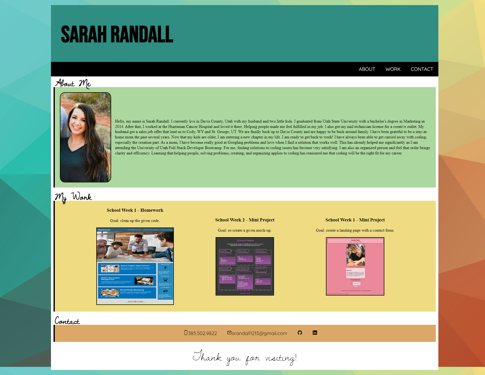

# Portfolio

## Description

**My motivation in completing this project was to have a portfolio to showcase my skills on order to land a career. 

**I built this project because I wanted to create a page that I can add to as I progress in the University of Utah Full-Stack Developer Bootcamp. 

**The problems solved while working on this project were getting a paragraph to wrap around an image while resizing the window and adjusting media queries to properly view my page as the screen gets smaller. 

**Through this project, I learned more about how flex boxes and media queries work. I learned how they differ, meaning flex boxes control how content takes up space and media queries control how the page is viewed/arranged as the screen gets resized. 

**I faced challenges with getting my content perfectly centered as the screen got smaller, like my name on the page. Seems as though there was something in the way from getting it aligned perfectly in the middle. 

**Features I would like to implement in the future would be to add more quality work to showcase on my page, as well as a more sleek user interface. 

## Website Appearance

## Link to Portfolio: 
https://srandall1213.github.io/Portfolio/

## Contributors

Justin P, https://hijmp.gumroad.com/l/guvoi, color19.png (background image)